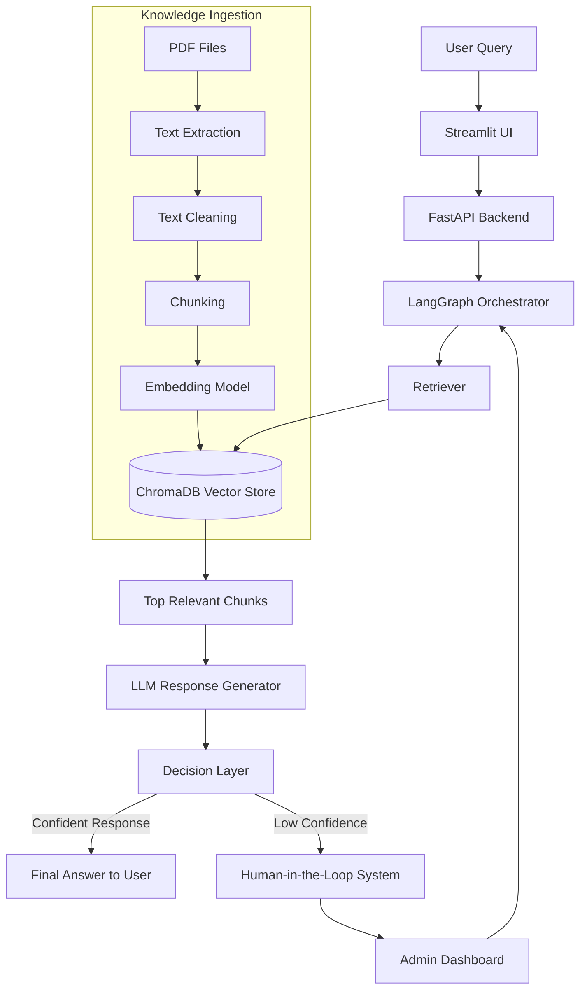

# 🤖 RAG-Based Customer Support Assistant

## 📌 1. System Overview

This project is an **AI-powered customer support system** built using Retrieval-Augmented Generation (RAG).  
It allows users to ask questions based on company PDFs and receive accurate, context-grounded responses.

Unlike traditional chatbots, this system does not rely only on an LLM. Instead, it retrieves relevant information from documents first and then generates responses using that context.  
It also includes a **Human-in-the-Loop (HITL)** mechanism for handling uncertain or sensitive queries.

---

## 🧠 2. Architecture Diagram

---

## ⚙️ 3. System Components

### 📄 Document Ingestion Layer
- Uploads PDF files into the system
- Extracts raw text from documents
- Cleans and normalizes content for processing

---

### ✂️ Chunking Module
- Splits large documents into smaller overlapping chunks
- Ensures semantic continuity between sections
- Optimized for embedding-based retrieval

---

### 🧠 Embedding & Vector Storage
- Converts text chunks into dense vector representations
- Stores embeddings in **ChromaDB**
- Enables semantic similarity search instead of keyword matching

---

### 🔎 Retrieval System
- Converts user query into embeddings
- Performs similarity search in vector database
- Returns most relevant document chunks

---

### 🤖 LLM Generation Layer
- Takes retrieved context + user query
- Generates grounded responses
- Prevents hallucination by restricting external knowledge

---

### 🔁 LangGraph Orchestrator
- Controls full workflow as a state machine
- Manages transitions between:
  - retrieval → generation → decision → response
- Maintains conversation memory per session

---

### ⚖️ Decision / Routing Layer
- Evaluates confidence of generated response
- Decides whether to:
  - return answer directly
  - escalate to human support

---

### 👨‍💻 Human-in-the-Loop (HITL)
- Activated for ambiguous or critical queries
- Pauses automated workflow
- Allows human agent to provide final response
- Resumes conversation after resolution

---

## 🔄 4. Data Flow

### 📥 Ingestion Flow
PDF Upload → Text Extraction → Cleaning → Chunking → Embedding → Stored in Vector DB

---

### 💬 Query Flow
User Query → Embedding Conversion → Vector Search → Context Retrieval → LLM Generation → Decision Layer →

- ✔ If confident → Return response  
- ⚠ If uncertain → Trigger HITL → Human response → Resume flow

---

## 🛠️ 5. Technology Stack

- **Frontend:** Streamlit (Chat UI + Admin Dashboard)
- **Backend:** FastAPI (Async API layer)
- **Workflow Engine:** LangGraph (State-based orchestration)
- **Vector Database:** ChromaDB (Semantic search storage)
- **LLM:** GPT / LLaMA-based model
- **Embeddings:** Sentence Transformers / OpenAI embeddings

---

## 🚀 6. Scalability & Design Decisions

### 📦 Efficient Retrieval
Chunking + vector search ensures fast retrieval even with large documents.

### ⚡ Async Backend
FastAPI enables handling multiple concurrent user queries efficiently.

### 🧠 Stateful Conversations
LangGraph maintains session memory for multi-turn chat support.

### 🔁 Modular Architecture
Each component (retrieval, generation, routing) is independent and replaceable.

### 🚀 Future Improvements
- Replace ChromaDB with Pinecone for cloud scaling
- Add response streaming (real-time typing effect)
- Add caching layer for repeated queries
- Integrate authentication for enterprise use

---

## ⭐ 7. Key Highlights

- RAG-based architecture reduces hallucination
- Human-in-the-loop ensures reliability
- Fully modular and scalable design
- Works on custom enterprise knowledge base
- Supports multi-turn conversational AI

---
